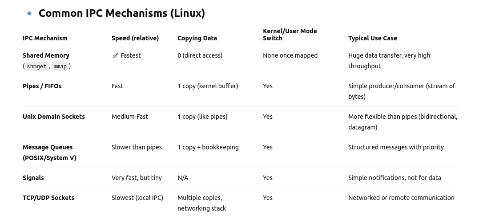

# 1. Memory Layout of Process
In Linux, every process has its own virtual address space. The kernel manages this space and maps it onto physical memory. The memory layout of a process describes how this virtual memory is divided into different regions, each region serving a purpose.

# Typical Process Memory Layout
Here's a high-level view of memory is arranged in a process:
+ Kernel space
+ Stack
+ Memory-mapped region : Shared lib
+ Heap
+ BSS Segment
+ Data Segment
+ Text Segment

# 2. Virtual Memory Management

Each process in Linux sees a virtual address space (e.g., 0x00000000 – 0xFFFFFFFF on 32-bit).

These addresses are not physical RAM addresses. Instead, the kernel maps virtual addresses → physical addresses using page tables and the MMU (Memory Management Unit).

This abstraction provides:

+ Isolation (one process can’t access another’s memory directly).

+ Protection (user code cannot touch kernel space).

+ Convenience (programs always see the same layout).

+ Efficiency (on-demand loading, swapping, caching).

# 3. IPC

IPC (Inter-Process Communication) : This is mechanisms provided by the OS that allow processes to exchange data and synchronize action.

# 3.1. Type of IPC in Linux

# 3.2 Message Queues

A message queue is a kernel-managed linked list of messages used for asynchronous communication between processes.

Each message has:

+ A type (long integer) → for filtering

+ A payload (text or binary data)

# Two APIs in Linux:

# a) System V Message Queues → (msgget, msgsnd, msgrcv, msgctl)

# b) POSIX Message Queues → (mq_open, mq_send, mq_receive, mq_close, mq_unlink)

You can get number of message in a message queue by reading "mq_struct". Before read "mq_struct",you need to invoke mq_getattr() function.

In addition, "mq_struct" is used to configure the message queue at initialization.

Can change behavior of mq_receive() on an empty_queue : 

+ Blocking Mode (default, queue opened without O_NONBLOCK)
If the queue is empty, mq_receive() will block until a new message arrives.
This is useful for a consumer thread/process that should wait for messages.

+ Non-Blocking Mode (queue opened with O_NONBLOCK)
If the queue is empty, mq_receive() will return immediately with -1.
errno will be set to EAGAIN, meaning "try again later".

Example : mq_open("/myqueue", O_RDONLY | O_NONBLOCK);

Similar to mq_receive() funtion, can change bihavior of mq_send() on a full empty_queue:

+ Blocking mode (default, no O_NONBLOCK)
If the queue is full, the sender blocks until space becomes available (i.e., until another process/thread calls mq_receive() and removes a message).
This can block indefinitely unless you use mq_timedsend() with a timeout.

Non-blocking mode (O_NONBLOCK)
+ If the queue is full, mq_send() returns -1 immediately.
+ errno = EAGAIN (“try again later”).

# 3.3 Shared Memory

# a) Theory of Shared Memory in IPC

# Introduce : 
Shared memory is one of the fastest IPC mechanisms because processes can directly access the same memory region with out copying data back and forth through the kernel.

# Definition :
Shared memory is a block of physical memory mapped into the address space of multiple processes. All participating processes can read/write to this region.

# Why does Share memory fast?
+ Unlike pipes, sockets, or message queues, shared memory doesn’t require copying data through the kernel.

+ Both processes just read/write the same memory region.

# Problem : Synchronization
+ Both processes just read/write the same memory region. Typically done using semaphores, mutexes, or condition variables.

# Types in Linux
+ System V Shared Memory (shmget, shmat, shmdt, shmctl)
+ POSIX Shared Memory (shm_open, mmap, ftruncate, shm_unlink)

# b) Theory of semaphore.

# Introduce
A semaphore is a kernel-managed counter used to control access to resource.
Two main types:
+ Binary semaphore (mutex-like) -> only 0 or 1 (unlock or lock)
+ Counting semaphore -> allows multiple processes to access limited instances of a resource (e.g., 5 database connections).

# Using Semaphore with Shared Memory

Typical roles:
+ Mutex Semaphore : Ensures only one writer (or reader) enters the critical section. Protects shared data from concurrent modifications.

+ Synchronization Semaphore:
Writer → Reader: "New data is available."
Reader → Writer: "I have consumed the data."

# 3.4) Pipe

